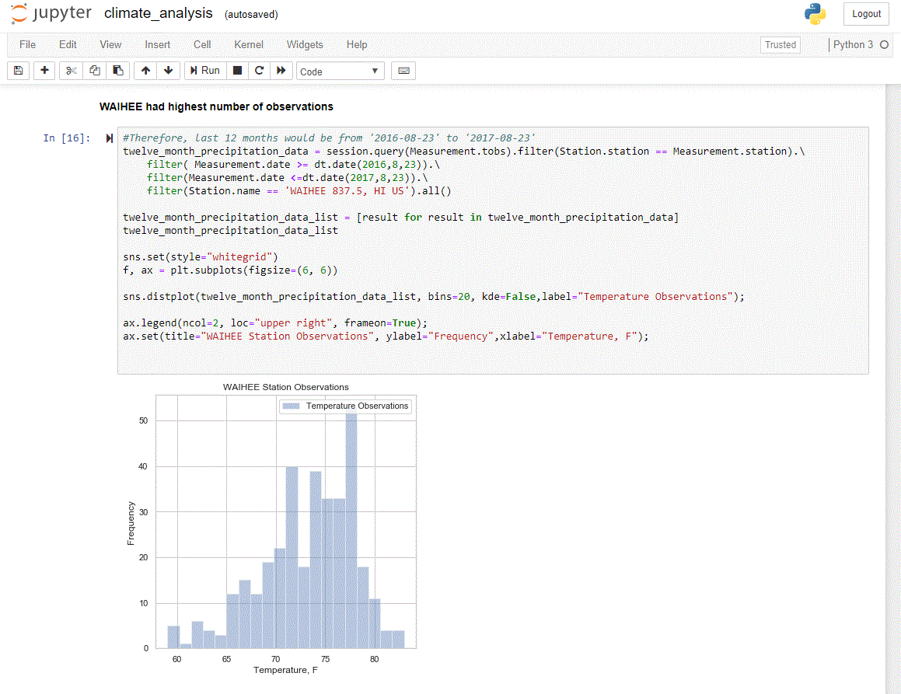

## Hawaii Data Engineering
Do climate analysis of the Honolulu, Hawaii area and provide a public climate analysis API. Used SQLAlchemy and Matplotlib for climate analysis and created a Flask API. The Flask API has the following routes:

 - /api/v1.0/precipitation (returns a JSON dictionary of dates and temperature observations from the last year)

 - /api/v1.0/stations (returns a JSON list of stations from the dataset)

 - /api/v1.0/tobs (returns a JSON list of temperature observations for the previous year)

 - /api/v1.0/[start] and /api/v1.0/[start]/[end] (returns a JSON list of minimum, average, and max. temperatures for a given start or start-end range).

